```python
result = pd.merge(left, right, how="inner", on=["key1", "key2"])
pd.merge(left, right, how="left", on=["key1", "key2"])

```

# Exploratory Data Analysis for Machine Learning
# 01 Data Overview
## 01.01 Initial Data Exploration


```python
import pandas as pd
import matplotlib.pyplot as plt
import seaborn as sns

train_df = pd.read_csv('train_df_path')
test_df = pd.read_csv('test_df_path')
```
### 01.01.01 Data Preview

```python
train_df.head(5)
test_df.head(5)
```

### 01.01.02 Data Info

```python
print('Train Info:')
print('--------------------------------------------')
display(train_df.info())

print('')
print('Test Info:')
print('--------------------------------------------')
display(test_df.info())
```

### 01.01.03 Null Values

```python
print('Train Null Values:')
print('--------------------------------------------')
display(train_df.isnull().sum())

print('')
print('Test Null Values:')
print('--------------------------------------------')
display(test_df.isnull().sum())
```


## 01.02 Dataset Statistics

```python
train_df.describe()
test_df.describe()
```


```python
def statistics_insights_format(train_df,test_df):
    print('Numeric Column Statistics (Rounded up to 2 decimal points)\n')
    train_dict = train_df.describe().to_dict()
    test_dict = test_df.describe().to_dict()

    columns = train_df.select_dtypes(include=['float']).columns

    for col in columns:
        print(col)
        train_mean = round(float(train_dict[col]['mean']),2)
        train_min = float(train_dict[col]['min'])
        train_max = float(train_dict[col]['max'])
        test_mean = round(float(test_dict[col]['mean']),2)
        test_min = float(test_dict[col]['min'])
        test_max = float(test_dict[col]['max'])
        
        print(f'train: mean={train_mean} min={train_min} max={train_max}')
        print(f'test: mean={test_mean} min={test_min} max={test_max}')
        print('')

statistics_insights_format(train_df,test_df)
```


# 02 Target Variable

```python
def show_target_pie_plot(df:pd.DataFrame,target:str):
	val_counts = df[target].value_counts()
	pie_labels = val_counts.index.values
	fig, ax = plt.subplots(nrows=1, ncols=2, figsize=(8,3))
	#fig.suptitle(target, fontsize=15, fontweight='bold')

	pie_colors = ['#4caba4', '#d68c78','#a3a2a2','#ab90a0', '#e6daa3', '#6782a8']
	pie_colors = pie_colors[:len(val_counts)]

	#Pie Chart -------------------------------------------------------------------
	wedges, texts, autotexs = ax[0].pie(
		x = val_counts,
		startangle = 0, #angle in which the first section starts
		textprops={
      		'size': 6, 
        	#'color': 'white',
         	#'fontweight':'bold'
        }, #text format
		colors = pie_colors, #section colors
		labels = pie_labels, #pie section texts
		
		#shows a circunference instead of a full circle
		wedgeprops = dict(
			width=0.35, #width of the circunferes
			edgecolor='white', #color of the section sorrounding line
			linewidth=2 #width of the section sorrounding line
		),
		
		#shows percentage of section
		autopct = '%1.1f%%',
		pctdistance = 0.83	
	)

	for text in texts:
		text.set_color('black')
		text.set_fontweight('normal')
	
	ax[0].set_title(f'{target} Distribution', fontsize=11)

	#Count Plot ------------------------------------------------------------------

	sns.countplot(ax=ax[1], data=df, x=target, palette=pie_colors)
	ax[1].set_title(f'Count plot of {target} Distribution',fontsize=11)
	for container in ax[1].containers:
		ax[1].bar_label(
      		container,
			fontsize=8,
			fontweight='bold'
        )

	ax[1].set_ylabel('Number of People', fontsize=8)
	ax[1].set_xlabel(target, fontsize=8)

	ax[1].get_legend().set_visible(False)
	sns.despine(left=False, top=True, bottom=False, right=True)
	
	#Settings --------------------------------------------------------------------
	plt.yticks(fontsize=6)
	plt.xticks(fontsize=6)
	#plt.xticks([])

	plt.show()

```


```python
show_target_pie_plot(train_df,'target_name')
```

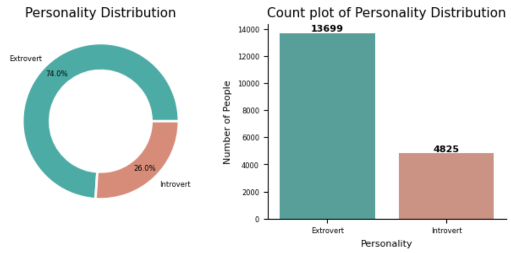


# 03 Categorical Features

## 03.01 Dataframe Simple Count

```python
top_n = 20
temp_df = df['feature'].value_counts().reset_index()
temp_df = temp_df.sort_values('count',ascending=False)
temp_df[:top_n].style.background_gradient(cmap='Purples')
```
![[Pasted image 20260220014303.png]]
## 03.02 Count Plot

```python
def show_barboxcount(df:pd.DataFrame,feature,fig_high:int=8):
    temp = pd.DataFrame(df[feature].value_counts()).reset_index().sort_values(by='count',ascending=False)
    top_n = len(temp)
    
    fig, ax = plt.subplots(
        nrows=1,
        ncols=2,
        figsize=(10,fig_high),
        gridspec_kw={'width_ratios':[3,1]}
    )
    fig.subplots_adjust(wspace=0.4)
    
    pal_colors = sns.color_palette('Set2')
    
    sns.despine(left=False, bottom=False, top=True, right=True)
    
    #Barplot ------------------------------
    col1=0
    sns.barplot(
        ax=ax[col1],
        y=temp[feature],
        x=temp['count'],
        hue=temp[feature],
        legend=False
    )

    for container in ax[col1].containers:
        ax[col1].bar_label(container, fontsize=7)
    
    ax[col1].grid(axis="x", linestyle=":", linewidth=0.7)
    ax[col1].tick_params(axis='y', labelsize=9)
    ax[col1].tick_params(axis='x', labelsize=9)
    ax[col1].set_ylabel(feature.capitalize(), fontsize=10)
    ax[col1].set_xlabel('Count', fontsize=10)
    ax[col1].title.set_text('{} Count'.format(feature.capitalize()))
    
    
    #Boxplot ---------------------------------
    
    col2=1
    sns.boxplot(ax=ax[col2], data=temp, y='count', color=pal_colors.as_hex()[0])
    ax[col2].tick_params(axis='y', labelsize=9)
    ax[col2].set_ylabel('Count', fontsize=10)
    ax[col2].title.set_text('Count Distribution')
    

    fig.suptitle(
	    'Categorical Feature: {}'.format(feature.capitalize()), 
	    fontsize = 18, fontweight = 'bold'
	)
```


```python
show_barcount(df,feature='brand',fig_high=2.5, top_n=15)
```

![[Pasted image 20260219081032.png]]


## 03.03 Count and Pie Plot

```python
def show_categorical_features_plot(df:pd.DataFrame, cat_columns:list):
    
    ncols = 1 if len(cat_columns) == 1 else 2
    nrow_groups = math.ceil(len(cat_columns) / 2)
    fig, ax = plt.subplots(
        nrows=nrow_groups *2, 
        ncols=ncols, 
        figsize=(4.5 * ncols,4*(nrow_groups)), 
        gridspec_kw={'height_ratios':[1,2]*nrow_groups}
    )
    
    #fig.suptitle(col_name, fontsize=15, fontweight='bold') 

    for index, col_name in enumerate(cat_columns):
        val_counts = df[col_name].value_counts()
        pie_labels = val_counts.index.values
        
        pie_colors = ['#4caba4','#d68c78','#a3a2a2','#ab90a0','#e6daa3','#6782a8']
        pie_colors = pie_colors[:len(val_counts)]
        
        row_idx = ((index-1)//2)*2
        col_idx = index%2

        #Count Plot -----------------------------------------------
        count_idx = row_idx if ncols == 1 else (row_idx,col_idx)
        
        sns.countplot(
	        ax=ax[count_idx], 
	        data=df, 
	        y=col_name, 
	        hue=col_name, 
	        palette=pie_colors,
	        legend=False
	    )

        for container in ax[count_idx].containers:
            ax[count_idx].bar
            ax[count_idx].bar_label(
                container,
                fontsize=8,
                #fontweight='bold'
            )
            
        ax[count_idx].set_title(
	        f"Count plot of {col_name}", 
	        fontsize=11, pad=12
	    )
        ax[count_idx].set_ylabel('Number of People', fontsize=8)
        ax[count_idx].set_xlabel('', fontsize=8)
        ax[count_idx].tick_params(axis='x', labelsize=8)
        ax[count_idx].tick_params(axis='y', labelsize=8)
        ax[count_idx].grid(axis="x", linestyle=":", linewidth=0.7)

        sns.despine(left=False, bottom=False, top=True, right=True)
        
        #Pie Chart ------------------------------------------------
        pie_idx = row_idx if ncols == 1 else (row_idx + 1,col_idx)

        wedges, texts, autotexs = ax[pie_idx].pie(
            x = val_counts,
            startangle = 80, #angle in which the first section starts
            textprops={
                'size': 7,
                #'color': 'white',
                #'fontweight':'bold'
            }, #text format
            colors = pie_colors, #section colors
            labels = pie_labels, #pie section texts

            #shows a circunference instead of a full circle
            wedgeprops = dict(
                width=0.35, #width of the circunferes
                edgecolor='white', #color of the section sorrounding line
                linewidth=2 #width of the section sorrounding line
            ),

            #shows percentage of section
            autopct = '%1.1f%%',
            pctdistance = 0.83	
        )   

        for text in texts:
            text.set_color('black')
            text.set_fontweight('normal')

        ax[pie_idx].set_title(f'{col_name} Distribution', fontsize=11)  

        for text in texts:
            text.set_color('black')
            text.set_fontweight('normal')

        ax[pie_idx].set_title(f'{col_name} Distribution', fontsize=11)

    #Settings ----------------------------------------------------------
    plt.tight_layout()
    plt.show()
```

```python
cat_columns = df[['col1','col2']].select_dtypes(include='object').columns
temp_df = df[['col1','col2']].apply(lambda x:x.str[:15]).copy()
cat_columns = cat_columns.to_list()

show_categorical_features_plot(temp_df, cat_columns)
```

![[Pasted image 20260220013928.png]]


## 03.04 Tree Map

```python
temp_df = df['feature'].value_counts().reset_index()
fig = px.treemap(temp_df, path=['feature'], values='count', title='Common Internal Colors')
fig.show()
```

![[Pasted image 20260220014621.png]]
## 03.05 Train - Test Comparison

```python

def show_categorical_features_plot(train_df:pd.DataFrame, test_df:pd.DataFrame, target:str):
    cat_columns = train_df.select_dtypes(include='object').columns.drop(target)
    cat_columns = cat_columns.to_list()
    
    fig, ax = plt.subplots(
        nrows=len(cat_columns)*2, 
        ncols=2, 
        figsize=(4*2,4*len(cat_columns)), 
        gridspec_kw={'height_ratios':[1,2]*len(cat_columns)}
    )
    
    #fig.suptitle(col_name, fontsize=15, fontweight='bold') 

    for index, col_name in enumerate(cat_columns):
        val_counts = train_df[col_name].value_counts()
        pie_labels = val_counts.index.values
        
        pie_colors = ['#4caba4','#d68c78','#a3a2a2','#ab90a0','#e6daa3','#6782a8']
        pie_colors = pie_colors[:len(val_counts)]

        #Count Plot [Train] -----------------------------------------------
        count_idx = index*2
        sns.countplot(
	        ax=ax[count_idx,0], 
	        data=train_df, 
	        y=col_name, 
	        hue=col_name, 
	        palette=pie_colors,
	        legend=False
	    )

        for container in ax[count_idx,0].containers:
            ax[count_idx,0].bar
            ax[count_idx,0].bar_label(
                container,
                fontsize=8,
                #fontweight='bold'
            )
            
        ax[count_idx,0].set_title(
	        f"[Train] Count plot of {col_name}", 
	        fontsize=11, pad=12
	    )
        ax[count_idx,0].set_ylabel('Number of People', fontsize=8)
        ax[count_idx,0].set_xlabel('', fontsize=8)
        ax[count_idx,0].tick_params(axis='x', labelsize=8)
        ax[count_idx,0].tick_params(axis='y', labelsize=8)
        ax[count_idx,0].grid(axis="x", linestyle=":", linewidth=0.7)

        sns.despine(left=False, bottom=False, top=True, right=True)
        
        #Count Plot [Test] ----------------------------------------------
        count_idx = index*2
        sns.countplot(
	        ax=ax[count_idx,1], 
	        data=test_df, 
	        y=col_name, 
	        hue=col_name, 
	        palette=pie_colors,
	        legend=False
	    )

        for container in ax[count_idx,1].containers:
            ax[count_idx,1].bar
            ax[count_idx,1].bar_label(
                container,
                fontsize=8,
                #fontweight='bold'
            )
            
        ax[count_idx,1].set_title(
	        f"[Test] Count plot of {col_name}", 
	        fontsize=11, pad=12
	    )
        ax[count_idx,1].set_ylabel('Number of People', fontsize=8)
        ax[count_idx,1].set_xlabel('', fontsize=8)
        ax[count_idx,1].tick_params(axis='x', labelsize=8)
        ax[count_idx,1].tick_params(axis='y', labelsize=8)
        ax[count_idx,1].grid(axis="x", linestyle=":", linewidth=0.7)

        sns.despine(left=False, bottom=False, top=True, right=True)
        
        #Pie Chart [Train] ------------------------------------------------
        pie_index = index*2 +1
        wedges, texts, autotexs = ax[pie_index,0].pie(
            x = val_counts,
            startangle = 80, #angle in which the first section starts
            textprops={
                'size': 7,
                #'color': 'white',
                #'fontweight':'bold'
            }, #text format
            colors = pie_colors, #section colors
            labels = pie_labels, #pie section texts

            #shows a circunference instead of a full circle
            wedgeprops = dict(
                width=0.35, #width of the circunferes
                edgecolor='white', #color of the section sorrounding line
                linewidth=2 #width of the section sorrounding line
            ),

            #shows percentage of section
            autopct = '%1.1f%%',
            pctdistance = 0.83	
        )   

        for text in texts:
            text.set_color('black')
            text.set_fontweight('normal')

        ax[pie_index,0].set_title(f'{col_name} Distribution', fontsize=11)
        
        #Pie Chart [Test] -------------------------------------------------
        pie_index = index*2 +1
        wedges, texts, autotexs = ax[pie_index,1].pie(
            x = val_counts,
            startangle = 80, #angle in which the first section starts
            textprops={
                'size': 7,
                #'color': 'white',
                #'fontweight':'bold'
            }, #text format
            colors = pie_colors, #section colors
            labels = pie_labels, #pie section texts

            #shows a circunference instead of a full circle
            wedgeprops = dict(
                width=0.35, #width of the circunferes
                edgecolor='white', #color of the section sorrounding line
                linewidth=2 #width of the section sorrounding line
            ),

            #shows percentage of section
            autopct = '%1.1f%%',
            pctdistance = 0.83	
        )   

        for text in texts:
            text.set_color('black')
            text.set_fontweight('normal')

        ax[pie_index,1].set_title(f'{col_name} Distribution', fontsize=11)

    #Settings ----------------------------------------------------------
    plt.tight_layout()
    plt.show()
```


```python
show_categorical_features_plot(train_df, test_df, 'feature_name')
```


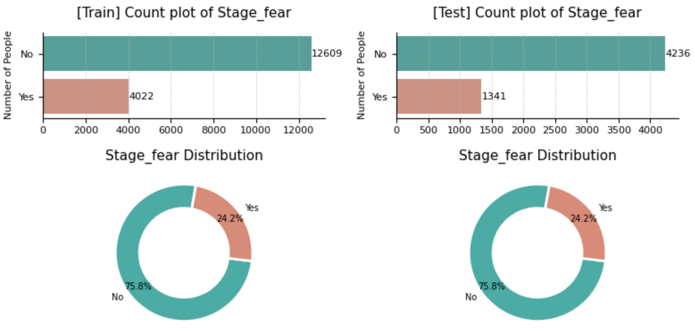


# 04 Date Features

## 04.01 Year Plot

```python
def car_year_plot(df:pd.DataFrame,feature):
    count_date = df[feature].value_counts()
    dates = [pd.to_datetime(str(period)) for period in count_date.index]
    pal_colors = sns.color_palette('Set2')

    plt.figure(figsize=(9,3))

    ax = sns.lineplot(
        x = dates,
        y = count_date.values,
        
        color = pal_colors[7],
        markers = True,
        marker = 'o',
        markersize = 4,
        dashes = False,
        markerfacecolor = pal_colors[0],
        markeredgewidth = 0
    )

    sns.despine(left=False, bottom=False, top=True, right=True)

    ax.set_ylabel('Frecuencia', fontsize=8)
    ax.set_xlabel('Año', fontsize=8)

    plt.grid(axis="both", linestyle=":", linewidth=0.7)
    plt.tick_params(axis='both', labelsize=8)
    plt.title(label='Distribución de la Variable model_year', fontsize=10)

    plt.show()
    
car_year_plot(df,'model_year')
```

![[Pasted image 20260220014833.png]]

# 05 Numerical Features

## 05.01 Feature Distribution

```python
def distribution_plot(df:pd.DataFrame, feature:str, bins:int=40, max_val:float=None, label_x:str=None):
	
    fig, ax = plt.subplots(nrows=2,ncols=1,figsize=(8,5))
    #ax = ax.flatten()
    pal = sns.color_palette('Set2')
    sns.despine(left=False, bottom=False, top=True, right=True)
    
    df_temp = df.copy()
    if max_val: df_temp = df_temp.loc[df[feature] <= (max_val)]
        
    #Histogram plot -------------------------------------------------------
    sns.histplot(
        df_temp[feature],
        ax=ax[0], 
        color=pal[0],
        fill=True, 
        kde=True, 
        bins=bins
    )
    ax[0].axvline(df[feature].mean(), color='red', linestyle='--', linewidth=2, label=f'Media: {df[feature].mean():,.0f}')
    ax[0].axvline(df[feature].median(), color='green', linestyle='--', linewidth=2, label=f'Mediana: {df[feature].median():,.0f}')
    ax[0].legend()
    ax[0].set_title(f'Distribución de la Variable {feature}', size = 14)
    ax[0].set_xlabel(None)
    ax[0].set_ylabel('Frecuencia')
    ax[0].grid(axis="y", linestyle=":", linewidth=0.7)
    ax[0].ticklabel_format(style='plain', axis='x')
    
    #Box plot -----------------------------------------------------------        
    sns.boxplot(
        data=df_temp, 
        x=feature, 
        #y='Dataset', 
        #hue='Dataset', 
        ax=ax[1],
        color=pal[0]
    )
    
    ax[1].set_title(f'Boxplot de la Variable {feature}', size = 14)
    ax[1].set_ylabel(None)
    ax[1].set_xlabel(label_x)
    ax[1].grid(linestyle=":", linewidth=0.7)
    
    ax[1].ticklabel_format(style='plain', axis='x')
    
    fig.suptitle(
	    'Distributions of Numeric Features', 
	    fontsize = 22, fontweight = 'bold'
	)

    plt.tight_layout()
```

![[Pasted image 20260220015126.png]]

## 05.02 Feature Distribution (Train - Test)

```python
def distribution_plot(train_df:pd.DataFrame, test_df:pd.DataFrame):
    features =[
	    'Time_spent_Alone', 'Social_event_attendance', 'Going_outside',
	    'Friends_circle_size', 'Post_frequency'
	]
	
    fig, ax = plt.subplots(nrows=len(features),ncols=2,figsize=(14,14),dpi=300)
    #ax = ax.flatten()
    pal = sns.color_palette('Set2')
    sns.despine(left=False, bottom=False, top=True, right=True)

    for idx, feature in enumerate(features):
        
        #Histogram plot -------------------------------------------------------
        sns.histplot(
	        train_df[feature],
	        ax=ax[idx,0], 
	        color=pal[0],
	        fill=True, 
	        kde=True, 
	        bins=40
	    )
        sns.histplot(
	        test_df[feature], 
	        ax=ax[idx,0], 
	        color=pal[1], 
	        fill=True, 
	        kde=True, 
	        bins=40
	    )
        
        ax[idx,0].set_title(f'Histogram plot of {feature}', size = 14)
        ax[idx,0].set_xlabel(None)
        ax[idx,0].set_ylabel(None)
        ax[idx,0].grid(axis="y", linestyle=":", linewidth=0.7)
        ax[idx,0].legend(['Train','Test'])
        
        #Voilin plot -----------------------------------------------------------
        violin_df = pd.concat([
            pd.DataFrame({'Dataset':'Train', feature: train_df[feature]}),
            pd.DataFrame({'Dataset':'Test', feature: test_df[feature]})
        ]).reset_index(drop=True)
        
        sns.violinplot(
	        data=violin_df, 
	        x=feature, 
	        y='Dataset', 
	        hue='Dataset', 
	        ax=ax[idx,1], 
	        palette=pal[:2]
	    )
	    
        ax[idx,1].set_title(f'Violin plot of {feature}', size = 14)
        ax[idx,1].set_ylabel(None)
        ax[idx,1].set_xlabel(None)
        ax[idx,1].grid(linestyle=":", linewidth=0.7)
        

    fig.suptitle(
	    'Distributions of Numeric Features', 
	    fontsize = 22, fontweight = 'bold'
	)
    #fig.legend(['Train','Test'])
    plt.tight_layout()

```


```python
distribution_plot(train_df, test_df)
```


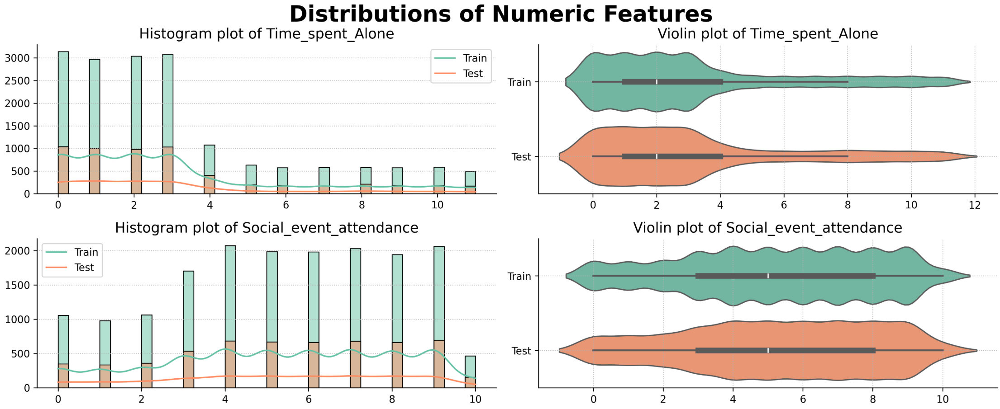


## 04.02 Feature Skew

```python
def feature_skew(df:pd.DataFrame):
    
    df_skew = pd.DataFrame(
	    df.skew(numeric_only=True),
	    columns=['skewness']
	).reset_index(names='feature')
	
    df_skew['result'] = df_skew['skewness'].apply(
	    lambda x : 'Highly' if abs(x) > 1 else 'Moderate' if abs(x) > 0.5 else 'Approximate'
	)
	    
    df_skew.style.background_gradient(subset='skewness')

    def highlight_range(val):
        if abs(val) > 1:
            return 'color: red'
        elif abs(val) > 0.5:
            return 'color: orange'
        else:
            return ''

    return df_skew.style.map(highlight_range, subset=['skewness'])
```

```python
feature_skew(train_df)
```

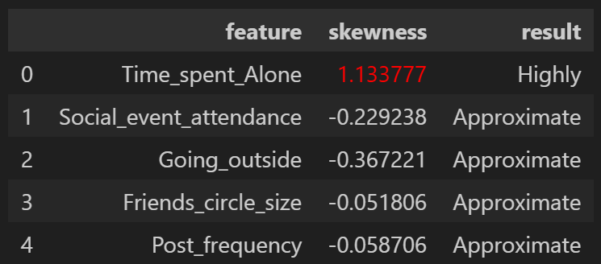


# 02 Multivariate

```python
def show_bardual_cross(df:pd.DataFrame, feature_main:str, features:list, title:str, fig_high:int=8):
    
    #pal_colors = sns.color_palette('Set2')
    fig_rows = math.ceil(len(features) / 2)
    fig, ax = plt.subplots(fig_rows,2, figsize=(11,fig_high*fig_rows))
    fig.subplots_adjust(wspace=0.4)
    sns.despine(left=False, bottom=False, top=True, right=True)
    
    for i, feature in enumerate(features):
        temp = pd.DataFrame(df.groupby(feature_main)[feature].nunique()).reset_index()
        temp.sort_values(by=feature,ascending=False,inplace=True)
        pos = i%2 if len(features) <= 2 else (i // 2, i % 2)

        sns.barplot(ax=ax[pos], data=temp, y=feature_main, x=feature, hue=feature_main)
        
        for container in ax[pos].containers:
            ax[pos].bar_label(container, fontsize=7)
    
        ax[pos].grid(axis="x", linestyle=":", linewidth=0.7)
        ax[pos].tick_params(axis='y', labelsize=8)
        ax[pos].tick_params(axis='x', labelsize=8)
        ax[pos].set_ylabel(feature_main.capitalize(), fontsize=9)
        ax[pos].set_xlabel(feature.capitalize(), fontsize=9)
        ax[pos].title.set_text('{} - {} Count'.format(feature_main.capitalize(), feature.capitalize()))
```

```python
show_bardual_cross(df, feature_main='brand',features=['model','fuel_type','int_col','ext_col','transmission','engine'],
                   title='Brand - Features Count', fig_high=9)
```

![[Pasted image 20260220015643.png]]


```python
def show_boxplots_unified(df:pd.DataFrame, num_feature:str, cat_feature:str, cat_labels:list, scale:int=1, step_size:float=None, max_val:float=None):

    plt.figure(figsize=(12, 1*len(cat_labels)))

    df_temp = df.loc[(df[cat_feature].isin(cat_labels))].copy()
    if max_val:
        df_temp = df_temp.loc[df_temp[num_feature] <= max_val]

    df_temp.loc[:, num_feature] = df_temp[num_feature] / scale

    ax = sns.boxplot(data=df_temp, x=num_feature, y=cat_feature, hue=cat_feature, width=0.8)

    plt.grid(axis="x", linestyle=":", linewidth=0.7)
    #plt.tick_params(axis='x', labelsize=8)
    plt.tick_params(axis='both', labelsize=9)
    if step_size:
        ax.xaxis.set_major_locator(ticker.MultipleLocator(step_size))

    plt.ylabel(cat_feature.capitalize(),fontsize=10)
    plt.xlabel('{} (Scale 1:{})'.format(num_feature.capitalize(),scale),fontsize=10)

    plt.tight_layout()
    plt.show()
```

```python
top_n = 5
brands=df['brand'].value_counts().reset_index().sort_values(by='count',ascending=False)['brand'][:top_n].values # top 10 labels
show_boxplots_unified(df, num_feature='price', cat_feature='brand', cat_labels=brands, scale=10, step_size=2_500, max_val=500_000)
```


![[Pasted image 20260220015807.png]]

```python
def show_custom_scatter(df:pd.DataFrame,main_feature:str,num_features:list):

    rows = math.ceil(len(num_features) / 3)
    cols = 3 if len(num_features) >=3 else len(num_features)
    fig,ax = plt.subplots(rows,cols,figsize=(12,4*rows))

    temp_df = df.copy()
    scale_y = 1
    if temp_df[main_feature].max() >= 1000000:
        scale_y = 10
        temp_df[main_feature] = temp_df[main_feature] / scale_y

    for i, feature in enumerate(num_features):

        row = i // 3
        col = i % 3
        scale_x = 1

        if temp_df[feature].max() >= 1000000:
            scale_x = 10
            temp_df[feature] = temp_df[feature] / scale_x

        idx = col if len(num_features) <= 3 else (row,col)

        sns.scatterplot(ax=ax[idx],data=temp_df, x=feature, y=main_feature)

        ax[idx].tick_params(axis='y', labelsize=8)
        ax[idx].tick_params(axis='x', labelsize=8)

        if not scale_y == 1:
            ax[idx].set_ylabel('{} (Scale 1:{})'.format(main_feature,scale_y),fontsize=9)
        else:
            ax[idx].set_ylabel(main_feature.capitalize(),fontsize=9)

        if not scale_x == 1:
            ax[idx].set_xlabel('{} (Scale 1:{})'.format(feature,scale_x),fontsize=9)
        else:
            ax[idx].set_xlabel(feature.capitalize(),fontsize=9)
```

```python
main_feature = 'model_year'
num_features = ['milage','price']
show_custom_scatter(df,main_feature,num_features)
```


![[Pasted image 20260220020048.png]]


# 05 Feature Correlation

## 05.01 Correlation Matrix

```python
def correlation_matrix(df:pd.DataFrame):
    plt.figure(figsize=(8,5))
    numeric_col = df.select_dtypes(include='number').columns.to_list()
    corr_data = df[numeric_col].corr()

    ax = sns.heatmap(
	    data=corr_data, 
	    annot=True, 
	    cmap='coolwarm', 
	    linewidths=0.5, 
	    fmt=',.2f', 
	    vmax=1, 
	    vmin=-1, 
	    center=0
	)
	
    ax.set_xticklabels(ax.get_xticklabels(), rotation = 0, fontsize = 6)
    ax.set_yticklabels(ax.get_yticklabels(), rotation = 0, fontsize = 6)

    plt.suptitle('Correlation Matrix', fontsize=16, fontweight='bold')
    plt.show()


```

```python
correlation_matrix(train_df)
```

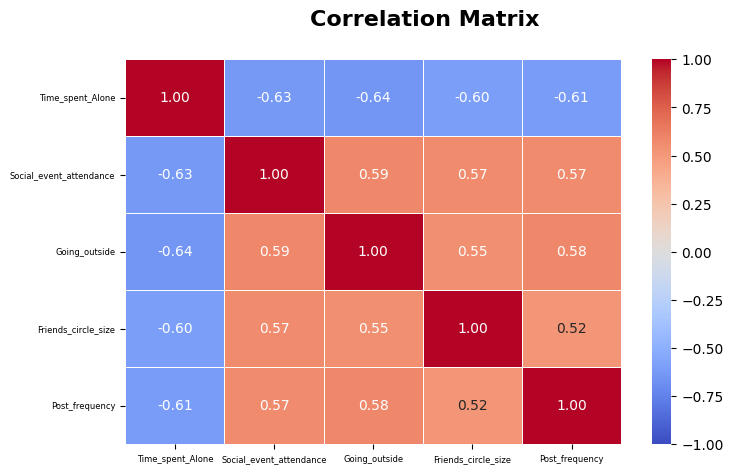


```python
pal = sns.color_palette('Set2')
sns.pairplot(data=train_df, hue='Personality', corner=True, palette=pal[:2])

plt.suptitle('Pairplot of Training Data', fontsize = 22, fontweight = 'bold')
plt.show()
```

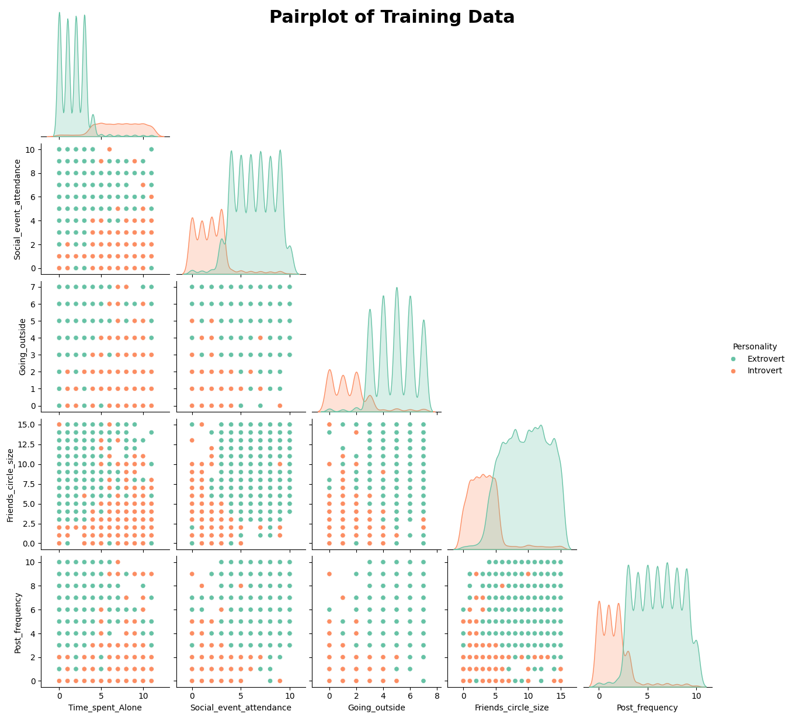


## 05.01 Correlation Insights

```python
def violin_plot(df:pd.DataFrame):
    features = [
	    'Time_spent_Alone', 'Social_event_attendance', 'Going_outside',
	    'Friends_circle_size','Post_frequency'
    ]
    fig, ax = plt.subplots(nrows=3,ncols=2,figsize=(14,10))

    sns.despine(left=False, bottom=False, top=True, right=True)
    pal = sns.color_palette('Set2')

    for idx, feature in enumerate(features):
        row_idx = idx // 2
        col_idx = idx % 2
        
        sns.violinplot(
	        data=df,
	        x='Personality', 
	        y=feature, 
	        ax=ax[row_idx,col_idx], 
	        hue='Personality', 
	        palette=pal[:2]
	    )
	    
        ax[row_idx,col_idx].set_title(
	        f'Violin plot of {feature} distributed by Personality', size = 14)
        ax[row_idx,col_idx].set_xlabel(None)
        ax[row_idx,col_idx].grid(linestyle=":", linewidth=0.7)
    
    if len(features)%2==1: 
        ax[len(features)//2,1].axis("off")
    
    #fig.suptitle('Distributions of Numeric Features', fontsize = 22, fontweight = 'bold')  

    plt.tight_layout()
    plt.show()
```

```python
violin_plot(train_df)
```


# 06 Missing Values

```python
def missing_val_heatmap(df:pd.DataFrame):
    plt.figure(figsize=(9,3))
    pal = ["#F4EEDF", "#4b6ea0"]
    sns.heatmap(data=train_df.isna().T, cmap=pal, cbar=False)
    plt.title('Missing Values Heatmap')
    plt.xticks(fontsize=8)
    plt.yticks(fontsize=8)
    plt.show()

missing_val_heatmap(train_df)
```

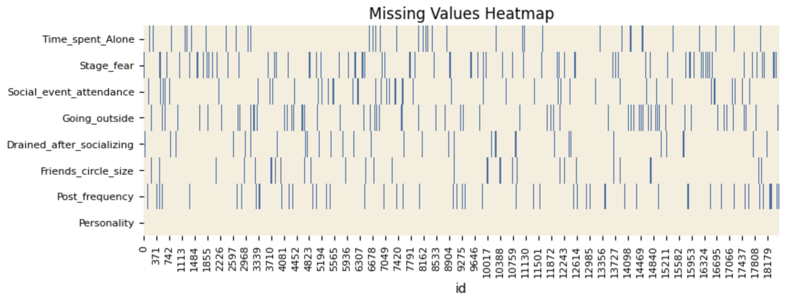


```python
def missing_values_count_plot(df:pd.DataFrame):
    plt.figure(figsize=(6,2))
    pal = sns.color_palette('Set2')

    plot_df = df.isnull().sum()
    plot_df = plot_df[plot_df>0].sort_values(ascending=True)

    sns.barplot(data=plot_df, color=pal[1], orient='y')
    sns.despine(left=False, bottom=False, top=True, right=True)
    
    plt.title('Missing Values Count by Column', fontsize=12)
    plt.xlabel('Number of Missing Values', fontsize=10)
    plt.ylabel('Columns', fontsize=10)
    plt.xticks(fontsize=8)
    plt.yticks(fontsize=8)
    plt.tight_layout()
    plt.show()

missing_values_count_plot(train_df)
```

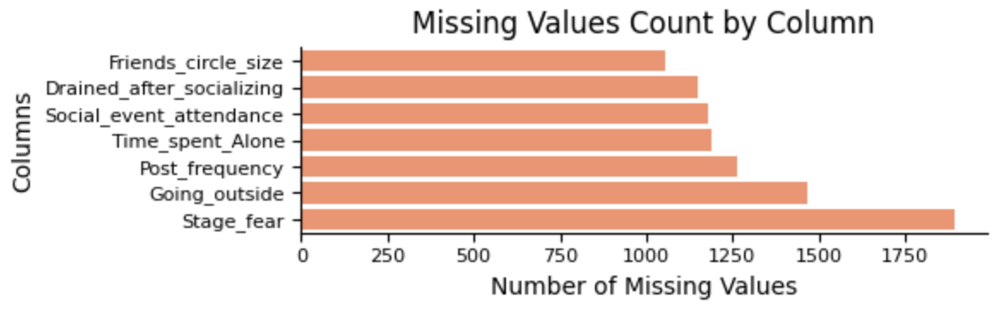


```python
def missing_values_correlation(df:pd.DataFrame,target:str):
    corr_matrix = df.drop(columns=target).isnull().corr()
    threshold = 0.8
    
    # Set up the figure with a high DPI for zooming
    plt.figure(figsize=(9, 4), dpi=100)

    mask_values = np.abs(corr_matrix) >= threshold
    mask = np.triu(np.ones_like(corr_matrix, dtype=bool))
    cmap = sns.diverging_palette(220, 20, as_cmap=True)

    sns.heatmap(corr_matrix, cmap=cmap, mask=mask, annot=mask_values, fmt=".2f", 
                linewidths=.5, cbar_kws={"shrink": 0.5}, vmin=-1, vmax=1,
                annot_kws={"size": 5})

    plt.title('Correlation Between Missing Values', fontsize=12)
    plt.xticks(rotation=0,fontsize=5)
    plt.yticks(fontsize=5)

    plt.tight_layout()

missing_values_correlation(train_df,'Personality')
```


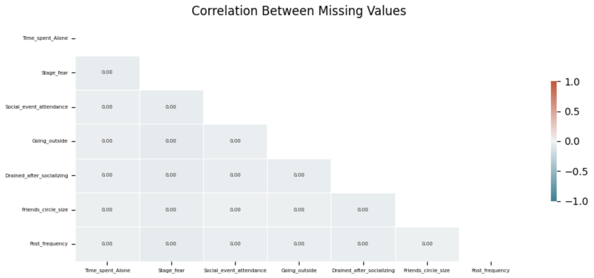


```python
def missing_by_row_plot(train_df:pd.DataFrame,test_df:pd.DataFrame):
    train_missing = train_df.isna().sum(axis=1).value_counts().reset_index()
    train_missing.columns = ["n_missing", "count"]
    train_missing["dataset"] = "train"
    
    test_missing = test_df.isna().sum(axis=1).value_counts().reset_index()
    test_missing.columns = ["n_missing", "count"]
    test_missing["dataset"] = "test"
    
    plt.figure(figsize=(4,3.5))

    pal = sns.color_palette('Set2')
    
    missing_df = pd.concat([train_missing, test_missing])

    ax = sns.barplot(data=missing_df, 
	    x='n_missing', y='count', hue='dataset', width=0.8, palette=pal[:2])
    ax.bar_label(ax.containers[0], fontsize=7)
    ax.bar_label(ax.containers[1], fontsize=7)

    ax.grid(axis='y', linestyle=":", linewidth=0.7)
    
    sns.despine(left=False, bottom=False, top=True, right=True)
    
    plt.title('Count of Missing Values by Row', fontsize=12)
    plt.ylabel('Count', fontsize=10)
    plt.xlabel('Number of Missing Values per Row', fontsize=10)
    plt.xticks(fontsize=8)
    plt.yticks(fontsize=8)
    plt.tight_layout()
    plt.show()
    
missing_by_row_plot(train_df,test_df)
```


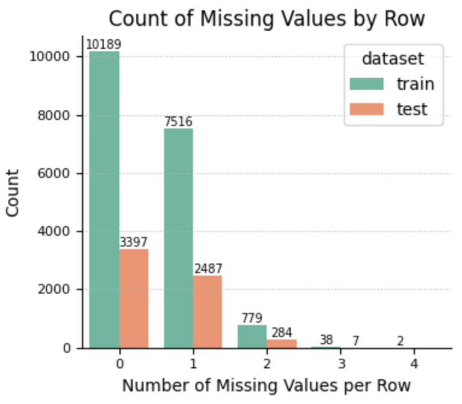


```python
def show_summary(df:pd.DataFrame):
    summary = pd.DataFrame(df.dtypes,columns=['Dtype'])
    summary['Count'] = df.count()
    summary['Unique_Count'] = df.nunique()
    summary['%Unique'] = summary['Unique_Count'] / len(df) * 100
    summary['Null_Count'] = df.isna().sum()
    summary['%Null'] = summary['Null_Count'] / len(df) * 100
    return summary

show_summary(train_df)
```

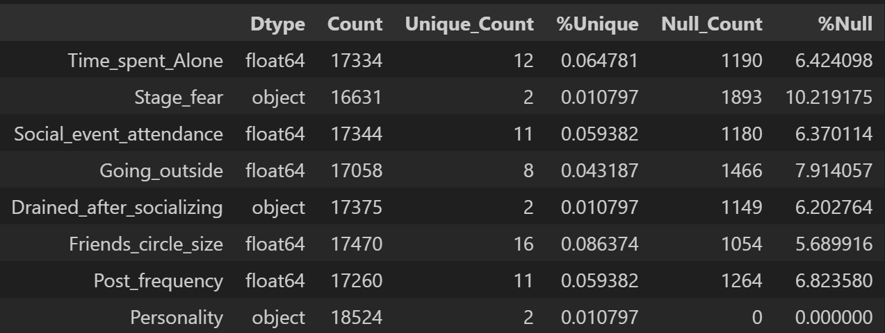


```python
def missing_value_review(df:pd.DataFrame):
    missing_by_row = df.isna().sum(axis=1)
    missing_rows = len(df.loc[missing_by_row>0])
    total_rows = len(df)
    
    print('Rows:',total_rows)
    print(f'Rows with missing values: {missing_rows} ({round(missing_rows*100/total_rows,2)}%)\n')
    
    print('Missing per row')
    for (miss_x_row,conteo) in missing_by_row.value_counts().items():
        print(f'{miss_x_row} : {conteo} ({round(conteo*100/total_rows,2)}%)')
        
    
print('Train Set-----------------------')
missing_value_review(train_df)
print('')
print('Test Set-----------------------')
missing_value_review(test_df)
```


```txt
Train Set----------------------- 
Rows: 18524 
Rows with missing values: 8335 (45.0%)

Missing per row 
0 : 10189 (55.0%) 
1 : 7516 (40.57%) 
2 : 779 (4.21%) 
3 : 38 (0.21%) 
4 : 2 (0.01%)
```

