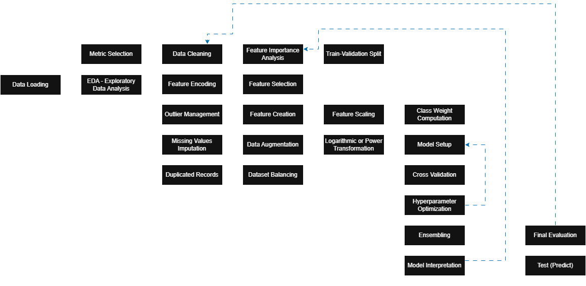

This document contains different machine learning techniques and algorithms used to build predictive models.  The document is structured resembling the classical flow steps to build an ml model.



This diagram is not an official representation, but was done based in my initial learning experience.
Commonly all the algorithms in this document are included in their own classes or in grouped classes, to keep the code organized.

# 01 Metric Selection

## 01.01 Accuracy

```python
correct_classifications = np.sum(np.equal(valid.values,predicted))
tot_classifications = len(valid)
accuracy = correct_classifications/tot_classifications
```


# 02 Data Preprocessing
## 02.01 Feature Encoding

### 02.01.01 Encoding Methods
#### Manual - Encoder

```python
df['binary_column'] = df['binary_column'].map({'Introvert':0, 'Extrovert':1})
```

#### Sklearn - Encoder

We have to encode categorical columns, as we cannot use text.
```python
from sklearn.preprocessing import LabelEncoder

#mask filter to exclude null values
mask = ~df[col].isna()

#Fit
le = LabelEncoder()
df[mask,'feature_encoded'] = le.fit_transform(df[mask,'feature'])

#Transform
mask = ~test_df[col].isna()
test_df[mask,'feature_encoded'] = le.transform(test_df[mask,'feature'])
```

### 02.01.02 Use of Multiple Encoders
For many columns we can use a dictionary like this:
```python
from sklearn.preprocessing import LabelEncoder

#Fit
encoders = {}
for col in ['col1','col2','col3']:
	mask = ~df[col].isna()
	le = LabelEncoder()
	df[mask, f'{col}_encoded'] = le.fit_transform(df[mask, col])
	encoders[col]=le

#Transform
for col in ['Drained_after_socializing','Stage_fear']:
	mask = ~test_df[col].isna()
	test_df[mask, f'{col}_encoded'] = encoders[col].transform(test_df[mask, col])

```


## 02.02 Outlier Management

### 02.02.01 Null Sample Outliers


```python
nan_allowed_x_sample = 3

#Retrieves the index samples to drop, which have more nan values than the allowed
temp_df = pd.DataFrame(df.isna().sum(axis=1),columns=['counting'])
na_idx = list(temp_df.loc[temp_df['counting']>nan_allowed_x_sample].index)

#Drops the samples and resets the index of the DataFrame
df.drop(na_idx,inplace=True)
df.reset_index(drop=True, inplace=True)
```


## 02.03 Missing Values Imputation

### 02.03.01 Identify null values
Identify columns with null values
```python
mising_val_count_by_column = df.isna().sum()
print(mising_val_count_by_column[mising_val_count_by_column>0])
```

### 02.03.02 Methods

#### 02.03.02.01 Dropping
##### Drop Columns
If the column have many null values and we believe the column is not relevant, we can remove it.
Remember this has to be applied for train and validation datasets.
```python
df.drop(columns=['col1','col2'], axis=1, inplace=True)
```

##### Drop Rows
We can consider this option only if we are sure we won't have empty values in a production environment. Otherwise, the prediction is going to fail for those cases.
```python

#To remove rows where exist a null value on any column
reduced_df = df.dropna()

#To remove rows based on specific columns
reduced_df = df.dropna(subset=['col_name_1','col_name_2'])

#To remove rows in the same dataframe
df.dropna(inplace=True)

```

#### 02.03.02.02 Imputer Benchmark
We use this method to find the best imputer to use with our dataset. Nevertheless, even if we find the estimator with best score, it doesn't mean the prediction will be the best one, so we probably will also need to test with different imputation methods.
##### Iterative Imputer
For this, benchmark we follow this processes:
1. Begin from a data set without null values
2. Get a comparison base with BayesianRidge with that dataset
3. Randomly add null values to the dataset
4. Get the score with SimpleEncoder
5. Get the score with many estimators with IterativeImputer
6. Plot the Scores

These steps are coded in following lines:

- **Module Import**

```python
import pandas as pd
import numpy as np
import matplotlib.pyplot as plt
import seaborn as sns

from sklearn.preprocessing import LabelEncoder
from sklearn.impute import SimpleImputer
from sklearn.experimental import enable_iterative_imputer  # required
from sklearn.impute import IterativeImputer

from sklearn.linear_model import BayesianRidge, Ridge
from sklearn.ensemble import RandomForestRegressor
from sklearn.neighbors import KNeighborsRegressor
from sklearn.pipeline import make_pipeline
from sklearn.kernel_approximation import Nystroem
from sklearn.model_selection import cross_val_score

N_SPLITS = 5
rng = np.random.RandomState(0)
```

- **Base comparison**
We stablish a comparison base to compare with the other estimators, for this we use the data set with no Nan values.

```python
br_estimator = BayesianRidge()
score_full_data = pd.DataFrame(
    cross_val_score(
        br_estimator, X_full, y_full, scoring = 'neg_mean_squared_error',
        cv=N_SPLITS
    ),
    columns=['Full Data']
)
```

- **Assigns null values to data**
Our data set does not have null values, so we have to randomly assign null values.
For that we have to look how many Nan features we usually have per sample in our full data set.

	- Multiple Nan columns

```python

X_missing = X_full.copy()
y_missing = y_full.copy()
missing_samples = np.arange(n_samples)
features = X_missing.columns

for i in range(n_samples):
    row = missing_samples[i]
    n_missing = rng.randint(1,4)
    missing_features = rng.choice(features, size=n_missing, replace = False)
    X_missing.loc[row,missing_features] = np.nan
    
#X_missing[missing_samples, missing_features] = np.nan
```

	- Single Nan Column

```python

X_missing = X_full.copy()
y_missing = y_full.copy()
missing_samples = np.arange(n_samples)
missing_features = rng.choice(n_features, n_samples, replace = True)

for i in range(n_samples):
    row = missing_samples[i]
    col = missing_features[i]
    
    X_missing.loc[row,col] = np.nan
    
#X_missing[missing_samples, missing_features] = np.nan
```


- **Scores with Simple Imputer**
We use the Simple Imputer with only the mean and median

```python
score_simple_imputer = pd.DataFrame()

for strategy in ('mean','median'):
    estimator = make_pipeline(
        SimpleImputer(missing_values=np.nan, strategy=strategy), BayesianRidge()
    )
    
    score_simple_imputer[strategy] = cross_val_score(
        estimator, X_missing, y_missing, scoring='neg_mean_squared_error', cv=N_SPLITS
    )
```


- **Scores with multiple estimators**
Now we use the iterative imputer to test with many estimators

```python
score_iterative_imputer = pd.DataFrame()
tolerances = (1e-3, 1e-1, 1e-1, 1e-2)

estimators = [
    BayesianRidge(),
    RandomForestRegressor(
        n_estimators=4,
        max_depth=10,
        bootstrap=True,
        max_samples=0.5,
        n_jobs=2,
        random_state=224
    ),
    make_pipeline(
        Nystroem(kernel="polynomial", degree=2, random_state=224), Ridge(alpha=1e3)
    ),
    KNeighborsRegressor(n_neighbors=15)
]

for impute_estimator, tol in zip(estimators, tolerances):
    estimator = make_pipeline(
        IterativeImputer(
            random_state = 224,
            estimator = impute_estimator,
            max_iter = 50,
            tol = tol
        ), 
        BayesianRidge()
    )
    
    estimator_name = f'{impute_estimator.__class__.__name__}_tol_{tol:.0e}' #adds the tolerance to the name
    
    score_iterative_imputer[estimator_name] = cross_val_score(
        estimator, X_missing, y_missing, scoring = 'neg_mean_squared_error', cv = N_SPLITS
    )
    
```

- **Plots Scores**
We concat the scores of all the estimators and plot it to look for the best, which is the lower one.

```python
scores = pd.concat(
    [score_full_data,score_simple_imputer,score_iterative_imputer],
    keys=['Original','SimpleImputer','IterativeImputer'], axis=1
)

fig, ax = plt.subplots(figsize=(13,6))
means = - scores.mean()
errors = scores.std()
means.plot.barh(xerr=errors, ax=ax)
plt.show()
```


#### 02.04.02.03 Imputation
This code updates the null values for another value.

##### Simple Imputer
The default strategy is the mean, but we can use others. 
Is recommended to use different imputers depending on the column type: 
- **Numerical columns**: mean, median
- **Categorical columns**: most_frequent, constant

```python
from sklearn.impute import SimpleImputer

#Setting
my_imputer = SimpleImputer(strategy='mean')

#Fit
imputed_X_train = pd.DataFrame(my_imputer.fit_transform(X_train))
imputed_X_train.columns = X_train.columns

#Transform
imputed_X_valid = pd.DataFrame(my_imputer.transform(X_valid))
imputed_X_valid.columns = X_valid.columns

```


##### KNN Imputer
Uses **k-Nearest Neighbors** based on a specified distance metric (Euclidean distance, cosine similarity,...)

```python
from sklearn.impute import KNNImputer

#Setting
knn_imputer = KNNImputer(n_neighbors=5)
numerical_columns = ['numerical_col1','numerical_col2']

#Fit
imputed_df = pd.DataFrame(knn_imputer.fit_transform(temp_df[numerical_columns]))
imputed_df.columns = numerical_columns
df[numerical_columns] = imputed_df.values

#Transform
imputed_df = pd.DataFrame(knn_imputer.transform(df[numerical_columns]))
imputed_df.columns = numerical_columns
df[numerical_columns] = imputed_df.values

```

##### Iterative Imputer
This uses statistics techniques to fill the null values.

- Iterative + BayesianRidge
If we do not choose an estimator we are using BayesianRidge by default.

```python
from sklearn.experimental import enable_iterative_imputer  # required
from sklearn.impute import IterativeImputer

#Setting
#imputer = IterativeImputer(estimator=BayesianRidge(), max_iter=10, random_state=0)
imputer = IterativeImputer(max_iter=10, random_state=42)
numerical_columns = ['numerical_col1','numerical_col2']

#Fit
imputed_df = pd.DataFrame(imputer.fit_transform(temp_df[numerical_columns]))
imputed_df.columns = numerical_columns
df[numerical_columns] = imputed_df.values

#Transform
imputed_df = pd.DataFrame(imputer.transform(df[numerical_columns]))
imputed_df.columns = numerical_columns
df[numerical_columns] = imputed_df.values

```


- Iterative + KNeighborsRegressor
```python
from sklearn.experimental import enable_iterative_imputer  # required
from sklearn.impute import IterativeImputer

numerical_columns = ['numerical_col1','numerical_col2']

#Setting
iter_imputer = IterativeImputer(
	estimator = KNeighborsRegressor(n_neighbors=15),
	max_iter=50,
	tol=1e-2,
	random_state = 224
)

#Fit
iter_imputer.fit(df[numerical_columns])

#Transform
imputed_df = pd.DataFrame(iter_imputer.transform(df[numerical_columns]))
imputed_df.columns = numerical_columns
df.loc[:,numerical_columns] = imputed_df.values
        
```


##### Quantile Group Imputer
This technique is used when a feature has a behavior similar to another feature.
So we can create some buckets (bins) respect the source (reference) feature and compute the median of our target feature for each bin.

```python
source_col = 'source_col_name' #Column used to segment the data
temp_bin_col = f'{source_col}_bin' #Temporal column to save the bins (segmentation)
target_col = 'target_col_name' #Column with missing values

#segments the data by ranged groups and assigns a value to each bin
df[temp_bin_col] = pd.qcut(df[source_col],q=[0,0.5,0.75,1.0],labels=[1,2,3])

#Fills the missing values based on the median of each bin
df[target_col] = df[target_col].fillna(
	df.groupby(temp_bin_col,observed=False)[target_col].transform('median')
)

#drops the temporal bin column
df.drop(columns = [temp_bin_col], inplace=True)
```


##### Quarter Imputation
This technique is used when the target feature has a strong seasonal behavior, for example cloth tendencies.

```python
#Ensure the date format
df['date_col'] = pd.to_datetime(df['date_col'])

#Creates a column to save que date quarter values
df['bin_quarter'] = df['date_col'].dt.quarter

#Fills the null values with the median or mean value related to each quarter
df['valor'] = df['valor'].fillna(
	df.groupby('bin')['valor'].transform('median')
)

```


## 02.04 Duplicated Records
We have to ensure our set does not have any duplicated rows, to avoid skew generation.

```python
personality_df.drop_duplicates()
```


# 03 Feature Engineering
## 03.01 Dataset Balancing

### Down sampling
```python
major_df = df.loc[df['target_col']==0]
minor_df = df.loc[df['target_col']==1]

df_major_downsampled = major_df.sample(n=len(minor_df),random_state=42)

#Combine
df_balanced = pd.concat([minor_df,df_major_downsampled])

df_balanced
```

### Up sampling - sklearn resample

```python
from sklearn.utils import resample

major_df = df.loc[df['target_col']==0]
minor_df = df.loc[df['target_col']==1]

df_minority_upsample = resample(
	minor_df,
	replace=True,
	n_samples=len(major_df),
	random_state=42
)

#Combine
df_balanced = pd.concat([major_df, df_minority_upsampled])
df_balanced = df_balanced.sample(frac=1, random_state=42).reset_index(drop=True)
 
```


# 04 Data Transformation
## 04.01 Feature Scaling

### 04.01.01 Min-Max Scaling
This method replaces the numerical values for a number on the requested range.
This is not recommended for categorical features.
By default the default range is (min_val=0, max_val=1).

- Nevertheless, this option is **not recommended** as this not generates a mapping to apply the same transformation to other sets.

```python
from mlxtend.preprocessing import minmax_scaling

scaled_data = minmax_scaling(df,columns=['Column1','Column2'],min_val=0,max_val=1)

```


### 04.01.02 Min-Max Scaler
This method replaces the numerical values for a number on the range between 0 - 1.
This is not recommended for categorical features.
By default the default range is (min_val=0, max_val=1).

- This option saves a mapping to reproduce the transformation.
- We cannot use this option if it does not have a Gaussian(Normal) distribution.
- Also this not work when there are many outliers.


```python
from sklearn.preprocessing import MinMaxScaler

scaler = MinMaxScaler()
X_train_scaled = scaler.fit_transform(X_train)
X_test_scaled = scaler.transform(X_test)

```


### 04.01.03 Standardization

This applies the normalization to scale the data.

Normalization: $x'=\frac{x - \mu}{\sigma}~$

- This method is one of the most common used.
- This stores the mean and standard deviation to apply it to other data sets.
- This is also good when the distribution is not Gaussian.

```python
from sklearn.preprocessing import StandardScaler

#Setting
feature_columns = ['colname1','colname2']
scaler = StandardScaler()

#Fit
scaler.fit(df[feature_columns])

#Transform
df[feature_columns] = scaler.transform(df[feature_columns])

```


### 04.01.04 Stats

This library have many statistics methods.

- We have to assure the data is positive.


```python
from scipy import stats

'''
To normalize we have to assure the data is positive 
'''
positive = data.columndata > 0
positive_data = positive.columndata.loc[positive]
```

#### Boxcox

```python
from scipy import stats

normalized_data = stats.boxcox(original_data) #use the data in column [0]

```

#### Zscore

```python
from scipy import stats

z_scores = stats.zscore(df['feature'])

```

#### Ttest_ind

```python
from scipy import stats

t_stat, p_val = stats.ttest_ind(group1, group2)
```

#### Probability distribution (Norm)

```python
from scipy.stats import norm

prob = norm.cdf(x=1.5, loc=0, scale=1)
```

#### Shapiro

```python
from scipy.stats import shapiro
stat, p = shapiro(data)
if p > 0.05:
    print("Probably normal")

```


# 05 Model Training & Selection

## 05.01 Class Weight Computation

### Count Scaling

```python
from collections import Counter

counts= Counter(train_y)
scale_pos_weight = counts[0] / counts[1]
```


### Weight Scaling

```python
from sklearn.utils.class_weight import compute_class_weight

weights = compute_class_weight('balanced', classes=np.unique(train_y), y=train_y)
scale_pos_weight = weights[0]/weights[1]
```


## 05.02 Model Setup


### 05.02.01 Supervised Regression

#### Decision Tree Regressor
Type: Single Model

```python
from sklearn.tree import DecisionTreeRegressor

model = DecisionTreeRegressor(random_state=0)
model.fit(train_X,train_y)

predicted = model.predict(valid_X)
```


#### Logistic Regression

```python
from sklearn.linear_model import LogisticRegression

model = LogisticRegression(random_state=0)
model.fit(train_X,train_y)


```


#### XGBoost (Extreme Gradient Boosting)
Type: Ensembled Model


```python
from xgboost import XGBRegressor


xgb_model = XGBRegressor(
    random_state=224,
    n_estimators=500,
    early_stopping_rounds=5,
    device='cuda'
)

xgb_model.fit(
    train_X,
    train_y,
    eval_set=[(valid_X, valid_y)],
    verbose=False
)


```


### 05.02.01 Supervised Classification

#### Decision Tree Classifier
Type: Single Model

```python
from sklearn.tree import DecisionTreeClassifier

model = DecisionTreeClassifier(random_state=0)
model.fit(train_X,train_y)

valid_pred_y = model.predict(valid_X)
```


#### Logistic Classifier

```python
from sklearn.linear_model import LogisticClassifier

model = LogisticClassifier(random_state=0)
model.fit(train_X,train_y)

valid_pred_y = model.predict(valid_X)
```

#### Random Forest Classifier

```python
from sklearn.ensemble import RandomForestRegressor

model = RandomForestRegressor(random_state=0)
model.fit(train_X,train_y)

valid_pred_y = model.predict(valid_X)
```


#### XGBoost (Extreme Gradient Boosting)
Type: Ensembled Model


```python
from xgboost import XGBClassifier

model = XGBClassifier(
	verbosity=0,
    objective='binary:logistic',
    n_estimators=500,
    
	learning_rate=0.01,
	eval_metric='logloss',
    early_stopping_rounds=15,
	
	reg_alpha=0, # L1
	reg_lambda=0, #
	max_depth=4, #(default=6)
	subsample=0.8,
	colsample_bytree=0.8,
	booster='dart',
	rate_drop=0.1,
    
    device='cuda', #options cuda, cpu, gpu
    random_state=224
)

model.fit(
    train_X,
    train_y,
    eval_set=[(valid_X, valid_y)],
    verbose=False
)

valid_pred_y = model.predict(valid_X)

```

#### LGBMClassifier (Lightgbm Classifier)

```python
import lightgbm
from lightgbm import LGBMClassifier, plot_importance

model = LGBMClassifier(
	verbosity=-1,
	objective='binary',
	boosting_type='gbdt',
	num_leaves=241,
	learning_rate=0.027986022796055752,
	n_estimators=278,
	subsample_for_bin=102981,
	reg_alpha=3.1592085019007348, # L1
	reg_lambda=2.7369888386787853, #
	max_depth=3, #(default=6)
	colsample_bytree=0.9555953782058253,
	subsample=0.8261062435399441,
	min_child_samples = 36,
	feature_fraction = 0.6105756293156525,
	bagging_fraction = 0.6122458005579449,
	scale_pos_weight=scale_pos_weight,
	random_state=224
)

model.fit(
	train_X,
	train_y,
	eval_set = [(valid_X, valid_y)]
)

valid_pred_y = model.predict(valid_X)

```


#### CatBoostClassifier

Simple Use

```python

model = CatBoostClassifier(
    iterations=300,
    depth=6,
    learning_rate=0.1,
    class_weights=[scale_pos_weight, 1],
    random_seed=224,
    verbose=0,
    scale_pos_weight=scale_pos_weight
)
    
model.fit(train_X, train_y)

valid_pred_y = model.predict(valid_X)


```


Validation Set Evaluation

```python
model = CatBoostClassifier(
    iterations=1000,
    learning_rate=0.1,
    depth=6,
    early_stopping_rounds=50,
    eval_metric='Accuracy',
    verbose=100,
    random_seed=224
)

model.fit(
	train_X, 
	train_y,
	eval_set=(X_val, y_val)
)

valid_pred_y = model.predict(valid_X)

```


## 05.03 Cross Validation

### sklearn - StratifiedKFold


- **Model Setup**

```python

param_grid = {
	'verbosity' : 0,
	'objective' : 'binary:logistic',
	'eval_metric' : 'logloss',
	'use_label_encoder' : False,
	'n_estimators' : 500,
	'max_depth' : 4,
	'learning_rate' : 0.01,
	'subsample' : 0.8,
	'colsample_bytree' : 0.8,
	'reg_alpha' : 0,
	'reg_lambda' : 0,
	'booster':'dart',
	'rate_drop':0.1,
	
	'device' : 'cuda',
	'random_state' : 224
}

model = XGBClassifier(**param_grid)

```

- **Cross Validation Setup**

```python
kf = StratifiedKFold(n_splits=5, shuffle=True, random_state=224)
scores = []
models = []

for train_idx, valid_idx in kf.split(df_X, df_y):
	fold_train_X, fold_train_y = df_X.iloc[train_idx], df_y.iloc[train_idx]
	fold_valid_X, fold_valid_y = df_X.iloc[valid_idx], df_y.iloc[valid_idx]

	model.fit(fold_train_X, fold_train_y)

	fold_preds_y = model.predict(fold_valid_X)
	score = accuracy(fold_valid_y, fold_preds_y) #accuracy function
	
	models.append(model)
	scores.append(score)

```


## 05.04 Hyperparameter Optimization
### 05.04.01 GridSearchCV

```python
param_grid = {
	'n_estimators' : [100, 300, 500],
	'max_depth' : [4, 6, 8],
	'learning_Rate' : [0.01, 0.05, 0.1],
	'subsample' : [0.8, 0.9, 1.0],
	'colsample_bytree' : [0.08, 1.0],
}

model = XGBClassifier(
	objective = 'multi:softmax',
	num_class = 3, #ommit this for binary classification, only for multiclass
	random_state = 42,
	device = cuda	
)

grid_search = GridSearchCV(
	estimator = model,
	param_grid = param_grid,
	
	scoring = 'accuracy',
	cv = 3,
	n_jobs = -1,
	verbose = 1
)

grid_search.fit(train_X, train_y)
```


### 05.04.02 RandomizedSearchCV

```python
```


### 05.04.03 Optuna

To use this hyperparameter optimization technique we need to define first the objective function, which has:
- The parameter grid with the range of values to evaluate the model
- The model selected
- The fit and prediction
- The score metric

This objective function is used in the Optuna code to evaluate different random values and find the best parameter combination.

#### Objective Function

Some common options to define the objective function are by just using the model or to complement with cross validation technique.

**Only Model Setup**
```python

def objective(trial):

	param_grid = {
		'verbosity' : 0,
		'objective' : 'binary:logistic',
		'eval_metric' : 'logloss',
		'use_label_encoder' : False,
		'n_estimators' : trial.suggest_int('n_estimators',100, 500),
		'max_depth' : trial.suggest_int('max_depth', 4, 8),
		'learning_rate' : trial.suggest_float('learning_rate',0.01, 0.1, log=True),
		'subsample' : trial.suggest_float('subsample', 0.8, 1.0),
		'colsample_bytree' : trial.suggest_float('colsample_bytree', 0.8, 1.0),
		'reg_alpha' : trial.suggest_float('reg_alpha', 1e-3, 10.0, log=True),
		'reg_lambda' : trial.suggest_float('reg_lambda', 1e-3, 10.0, log=True),
		#'num_class' : 2,
		'random_state' : 224,
		'device' : 'cuda'
	}

	model = XGBClassifier(**param_grid)
	model.fit(train_X, train_y)

    preds = model.predict(valid_X)
    score = accuracy(valid_y, preds) #accuracy function

	return score

```


**Model with Cross Validation
```python

def objective(trial):

	#Model Setup ----------------------------------------------------
	param_grid = {
		'verbosity' : 0,
		'objective' : 'binary:logistic',
		'eval_metric' : 'logloss',
		'use_label_encoder' : False,
		'n_estimators' : trial.suggest_int('n_estimators',100,500),
		'max_depth' : trial.suggest_int('max_depth',4,8),
		'learning_rate' : trial.suggest_float('learning_rate',0.01,0.1,log=True),
		'subsample' : trial.suggest_float('subsample',0.8,1.0),
		'colsample_bytree' : trial.suggest_float('colsample_bytree',0.8,1.0),
		'reg_alpha' : trial.suggest_float('reg_alpha',1e-3,10.0,log=True),
		'reg_lambda' : trial.suggest_float('reg_lambda',1e-3,10.0,log=True),
		#'num_class' : 2,
		'random_state' : 224,
		'device' : 'cuda'
	}
	
	model = XGBClassifier(**param_grid)

	#Cross Validation Setup ------------------------------------------------
	kf = StratifiedKFold(n_splits=5, shuffle=True, random_state=224)
	scores = []
    models = []

	for train_idx, valid_idx in kf.split(df_X, df_y):
		fold_train_X, fold_train_y = df_X.iloc[train_idx], df_y.iloc[train_idx]
        fold_valid_X, fold_valid_y = df_X.iloc[valid_idx], df_y.iloc[valid_idx]

		model.fit(fold_train_X, fold_train_y)

	    fold_preds_y = model.predict(fold_valid_X)
	    score = accuracy(fold_valid_y, fold_preds_y) #accuracy function

		scores.append(score)

	return scores

```

#### Optuna Logic

We feed this code with the objective function previously defined.
If we do not use a sample, by default we are using TPESampler()

```python
import optuna
from optuna.samplers import TPESampler

#Optuna Setting
study = optuna.create_study(
	sampler=TPESampler( #Tree-structured Parzen Estimator
		n_startup_trials=30, #first 30 trials are random, then a model proposes
		multivariate=True, #False:tunes hyperparameters independently, True: interactions between hyperparameters
		seed=42 #Ensures reproducible results
	),
	direction='maximize'
)

#Optimization
study.optimize(objective,n_trials=100)
```


```python
print("Best Accuracy:", study.best_value)
print("Best Params:", study.best_params)
```


### 05.04.04 BayesianOptimization


```python
```


## 05.05 Ensembling


#### Voting Classification (sklearn - VotingClassifier)


```python

from sklearn.ensemble import VotingClassifier

voting = VotingClassifier(
	estimators=[
		('model1_abrv',model1),
		('model2_abrv',model2),
		('model3_abrv',model3)
	],
	voting='soft' #options: hard and soft
)

voting.fit(X_train, y_train)
```

#### Bagging

```python

```

#### Boosting

```python
```

#### Stacking

```python
```


